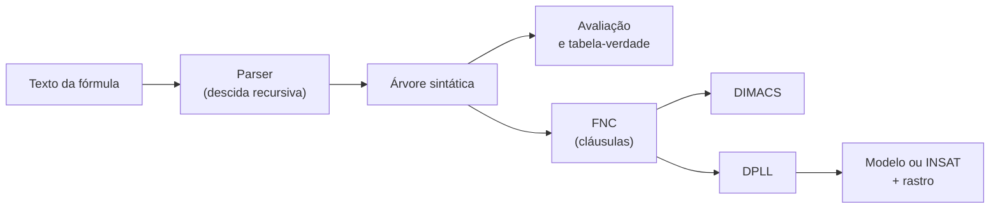

# 🍕 Pizzaiolo Lógico

**Existe uma pizza que respeita todas as regras do cliente e da cozinha?**
Este projeto responde com lógica proposicional: modelamos o problema, convertemos para forma normal conjuntiva e procuramos a resposta com o algoritmo DPLL, tudo em JavaScript, rodando direto no navegador.

> Trabalho de **Lógica para Computação** · Engenharia da Computação · 5ª fase
> Grupo: **[João Victor Mendes, Isabel Schifler, Elmar Grossl Júnior]**


---

## 🧀 O problema

Na pizzaria, o cliente monta a pizza escolhendo ingredientes, e a cozinha impõe regras de combinação. Cada ingrediente é uma **variável proposicional**: verdadeiro = vai na pizza, falso = fica de fora.

| Variável | Ingrediente | | Variável | Ingrediente |
|:-:|---|---|:-:|---|
| `B` | Bacon | | `N` | Manjericão |
| `C` | Calabresa | | `O` | Cebola |
| `G` | Gorgonzola | | `P` | Palmito |
| `M` | Muçarela | | `T` | Tomate |

### As regras

| # | Em português | Fórmula |
|---|---|---|
| R1 | Precisa de algum queijo: muçarela ou gorgonzola | `M ∨ G` |
| R2 | A cozinha não mistura os dois queijos | `¬(M ∧ G)` |
| R3 | Exatamente um sabor principal: calabresa ou palmito | `C ↔ ¬P` |
| R4 | Bacon só vai com cebola | `B → O` |
| R5 | Gorgonzola não combina com tomate | `G → ¬T` |
| R6 | Precisa de algo fresco: tomate ou manjericão | `T ∨ N` |
| R7 | Bacon com calabresa pede manjericão | `B ∧ C → N` |

O problema completo é **Φ = R1 ∧ R2 ∧ … ∧ R7**. Uma pizza válida é um **modelo** de Φ.

- ✅ **Satisfatível:** das 256 combinações possíveis, **23** são pizzas válidas.
- ❌ **Variante impossível:** cliente intolerante à lactose (`¬M ∧ ¬G`). Sem queijo nenhum, R1 não pode ser satisfeita, e o DPLL chega ao conflito só com propagação unitária, sem nenhum "chute".

---

## ⚙️ Como funciona



1. **Representação:** gramática em níveis de precedência (`↔` < `→` < `∨` < `∧` < `¬`), com `→` associando à direita. O parser aceita símbolos Unicode (`¬ ∧ ∨ → ↔`) e ASCII (`~ & | -> <->`).
2. **Satisfatibilidade:** força bruta sobre a tabela-verdade (2ⁿ linhas) e DPLL com propagação unitária, decisão e retrocesso.
3. **FNC:** eliminação de `→` e `↔`, empurrar `¬` com De Morgan, distribuir `∨` sobre `∧` e remover cláusulas repetidas e tautológicas.
4. **Saída em DIMACS**, o formato padrão dos resolvedores SAT. Para a pizza, são 7 variáveis e 8 cláusulas:

```
c B=1 C=2 G=3 M=4 N=5 O=6 P=7 T=8
p cnf 8 8
...
```

---

## ✨ O que tem na página

| Seção | Conteúdo |
|---|---|
| **Contexto** | Variáveis, regras em português e em lógica, variante insatisfatível |
| **Representação** | Gramática, árvore da regra R7, notação prefixa, DAG, custo O(n) |
| **SAT** | Definições, força bruta, NP-completude, DPLL feito à mão |
| **FNC** | Conversão passo a passo, DIMACS, explosão exponencial, Tseitin |
| **Laboratório** | Digite qualquer fórmula e veja tabela-verdade, FNC, DIMACS e rastro do DPLL |
| **Jogo** | *Pizzaiolo Lógico*: 5 clientes, 2 deles com pedidos impossíveis, 2 dicas do DPLL |
| **Testes** | Testes automáticos executados ao abrir a página |
| **Código** | O núcleo lógico completo, visível na própria página |
| **Roteiro** | Slides, responsáveis e perguntas prováveis da arguição |

---

## 🚀 Como rodar

Não precisa instalar nada.

1. Baixe ou clone o repositório.
2. Abra o arquivo `pizzaria.html` em qualquer navegador moderno.

Os testes automáticos rodam sozinhos ao abrir a página (seção 7): conferem o parser, comparam força bruta com DPLL e verificam se a FNC é equivalente à fórmula original em **todas** as linhas da tabela-verdade.

Para publicar no **GitHub Pages**: *Settings → Pages → Deploy from a branch* e escolha a branch principal. Se quiser que a página abra direto na raiz do site, renomeie o arquivo para `index.html`.

---

## 📁 Estrutura

```
.
├── pizzaria.html   # página completa: texto, núcleo lógico, laboratório, jogo e testes
└── README.md
```

---

## 🔍 Limitações

- O DPLL não usa literal puro nem aprende cláusulas (não é CDCL), e a heurística de decisão é simples.
- A transformação de Tseitin está explicada, mas não implementada.
- Regras de cardinalidade (ex.: "exatamente 3 ingredientes") não foram modeladas, para manter o exemplo pequeno.

---

## 🤖 Uso de IA

O trabalho foi desenvolvido a partir da divisão dos conteúdos entre os alunos, que ficaram responsáveis por pesquisar, redigir e organizar suas respectivas partes de forma individual. Posteriormente, todo o conteúdo produzido foi reunido e revisado em conjunto.

Após a organização das informações, foi utilizada a ferramenta Claude para auxiliar na formatação e estruturação do material em HTML e CSS, com o objetivo de criar uma apresentação interativa como alternativa ao formato tradicional de slides.

---

## 📚 Referências

- SILVA, F. S. C.; FINGER, M.; MELO, A. C. V. *Lógica para Computação*. São Paulo: Thomson Learning, 2006.
- HUTH, M.; RYAN, M. *Lógica em Ciência da Computação*. 2. ed. Rio de Janeiro: LTC, 2008.
- DAVIS, M.; LOGEMANN, G.; LOVELAND, D. A machine program for theorem-proving. *Communications of the ACM*, 5(7), 1962.
- COOK, S. A. The complexity of theorem-proving procedures. *STOC*, 1971.
- TSEITIN, G. S. On the complexity of derivation in propositional calculus, 1968.

---

## 👥 Equipe

| Integrante | Responsabilidade |
|---|---|
| [Isabel] | [Contexto, Representação e Jogo] |
| [Elmar] | [SAT, FNC e Laboratório] |
| [Mendes] | [Testes, Código e Roteiro] |